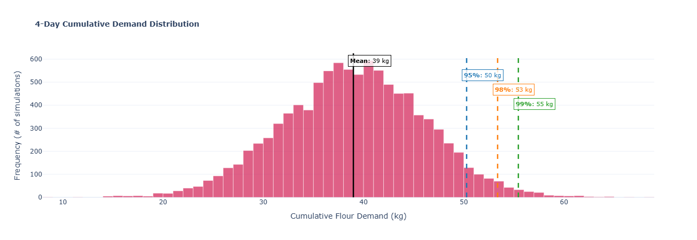

# Bakery Inventory Optimization  
### Demand Forecasting & Inventory Decisions under Uncertainty

**End-to-end data science project** focused on translating raw sales data into actionable inventory decisions for a small bakery, reducing stockouts while controlling waste.

**Tech stack:** Python · Pandas · NumPy · Scikit-Learn · Statsmodels · Prophet · Plotly · Streamlit  
**Status:** Completed · Reproducible · Business-oriented

---

## Motivation
Inventory planning is a recurring challenge across industries:

- Insufficient stock leads to lost sales and operational disruptions  
- Excess inventory increases holding costs, waste, and inefficiencies  

This project tackles that problem by combining **time series forecasting** with **probabilistic inventory planning**, moving beyond point predictions toward **risk-aware decision making**.

The goal is not just to forecast demand, but to **recommend how much inventory should be held**, given a desired service level.

---

## Problem Statement

Given historical transactional data:

- Forecast short-term demand for a critical inventory item
- Quantify uncertainty around forecasts
- Recommend inventory levels aligned with target service levels (e.g. 95%, 99%)

This project uses flour demand as a concrete case study, but the focus is not on a specific product.  
Instead, it emphasizes **building a reusable decision framework** applicable to retail, manufacturing, logistics, and broader supply chain contexts.

---

## Data & Feature Engineering

- Source: real-world transactional data (`bread basket.csv`)
- Individual product sales were **mapped to estimated flour consumption (kg)** per SKU
- Transactions were aggregated into a **daily time series of flour demand**

This step bridges the gap between *sales data* and *operational decisions*, a common challenge in real businesses.

---

## Methodology

The workflow follows a production-oriented data science approach:

### 1. Exploratory Data Analysis
- Daily demand distribution analysis
- Strong **weekly seasonality**, with peaks during weekends

### 2. Model Benchmarking
Multiple forecasting models were evaluated using **expanding window backtesting**:

- Seasonal Naive (baseline)
- ETS (Error, Trend, Seasonality)
- SARIMAX
- Prophet

**Evaluation metrics:** MAE, RMSE, MAPE, WAPE, sMAPE

### 3. Model Selection
The **ETS model** consistently outperformed alternatives across all metrics and showed stable performance across different time splits.

| Model           | MAE  | RMSE | MAPE (%) | WAPE (%) | sMAPE (%) |
|-----------------|------|------|----------|----------|-----------|
| **ETS**         | **2.74** | **3.45** | **22.89** | **18.68** | **19.25** |
| Prophet         | 3.49 | 4.10 | 26.51 | 22.79 | 25.26 |
| SARIMAX         | 2.87 | 3.54 | 23.83 | 19.43 | 20.09 |
| Seasonal Naive  | 3.26 | 4.02 | 25.30 | 22.25 | 22.50 |


---


### 4. Probabilistic Forecasting
Rather than relying on point forecasts:

- Model residuals were bootstrapped
- **10,000 Monte Carlo simulations** were generated
- Demand quantiles were computed for different service levels

This enables inventory decisions under uncertainty.

---

## Inventory Policy: Safety Stock & Reorder Point

For a **lead time of 4 days**, the recommended inventory levels are:

| Service Level | Total Stock (kg) | Safety Stock | Interpretation |
|--------------|------------------|--------------|----------------|
| 50%          | 39.0             | 0.0          | High risk of stockouts |
| **95%**      | **50.3**         | **+11.3**    | Balanced and practical |
| 99%          | 55.4             | +16.5        | Conservative, peak-demand scenarios |

> A buffer of **~11 kg of flour** is enough to satisfy demand in **95% of scenarios**, according to simulated future paths.

---

## Interactive Dashboard

A **Streamlit application** was built to make results accessible to non-technical users.

**Key features:**
- Historical demand visualization
- Forecast comparison across models
- Fan charts with confidence intervals
- Safety stock calculator based on service level

Link: ---


📌 *Demo:*  


---

## Project Structure

```text
├── .streamlit/          # Streamlit configuration
├── app.py               # Interactive dashboard
├── bread basket.csv     # Raw transactional data
├── notebook.ipynb       # EDA, modeling, validation
├── requirements.txt     # Dependencies
└── README.md            # Documentation
```

---

## How to Run Locally

```bash
git clone https://github.com/ssantioviedo/Bakery-Inventory-Optimization--Demand-Forecasting
cd Bakery-Inventory-Optimization--Demand-Forecasting
pip install -r requirements.txt
streamlit run app.py
```

---

## Next Steps & Extensions

This project lays the foundation for more advanced inventory optimization strategies, including:

- Economic Order Quantity (**EOQ**) to determine optimal order sizes given holding and ordering costs

- Explicit modeling of holding, shortage, and ordering costs

- Multi-item inventory optimization

- Incorporating perishability and expiration dates to model spoilage risk and improve inventory decisions for time-sensitive materials.

- Dynamic inventory policies adapting to changing demand volatility

- Deployment with automated data refresh (e.g. daily or real-time updates)

These extensions were considered conceptually and represent natural next steps toward a production-grade inventory system.

---

## What This Project Demonstrates

- Translating ambiguous business problems into quantitative models

- Time series forecasting with proper validation

- Probabilistic reasoning and risk-aware decision making

- Designing inventory policies rather than isolated forecasts

- Clear communication of results to technical and non-technical audiences

---

## Author

**Santiago Oviedo** | *Data Scientist*

🔗 **LinkedIn**: https://linkedin.com/in/ssantioviedo